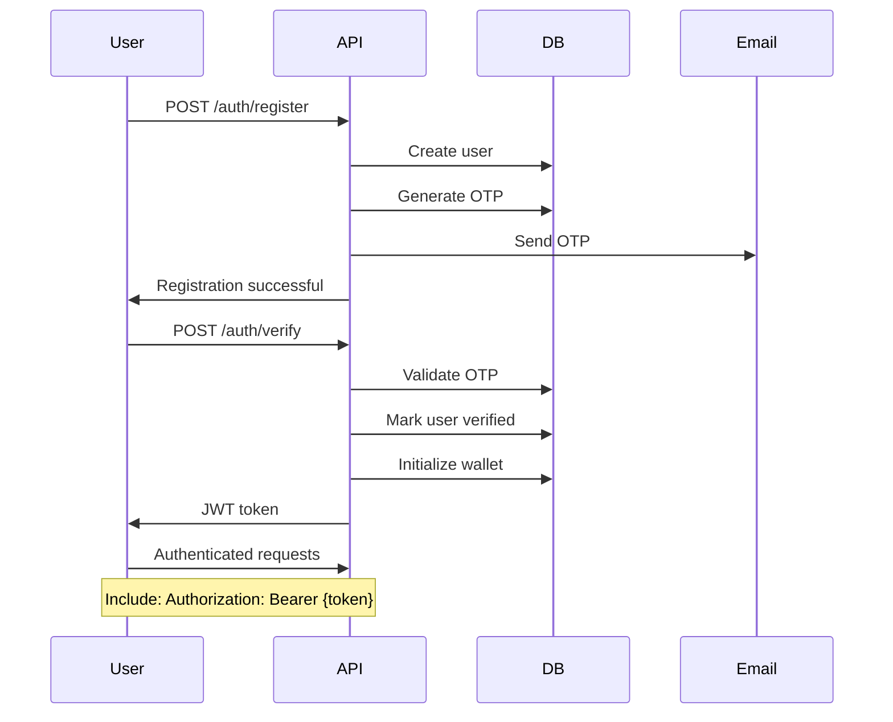
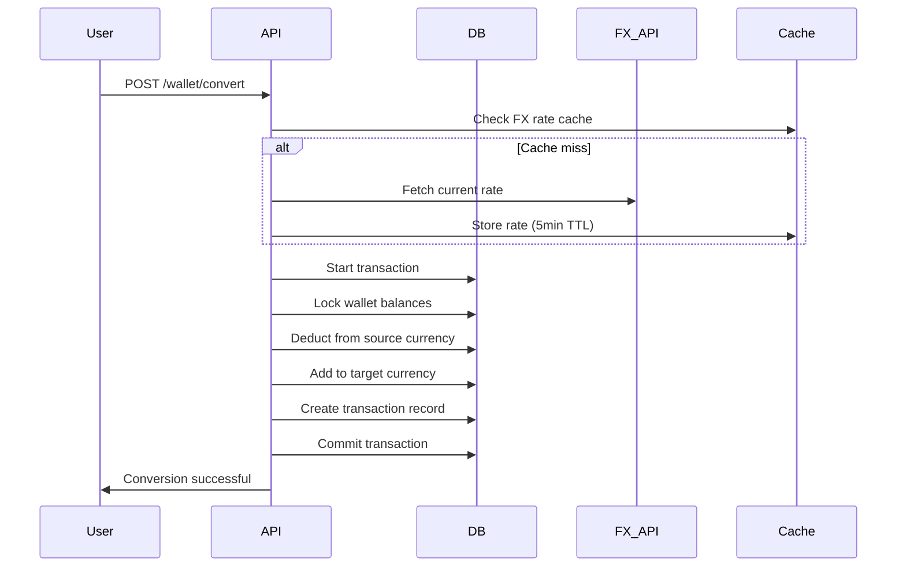

# FX Trading App - Backend

A robust foreign exchange trading platform built with NestJS, TypeORM, and PostgreSQL. Users can register, verify their email, manage multi-currency wallets, and trade currencies using real-time exchange rates.

## Table of Contents

- [Features](#features)
- [Tech Stack](#tech-stack)
- [Architecture](#architecture)
- [Prerequisites](#prerequisites)
- [Installation](#installation)
- [Configuration](#configuration)
- [Running the Application](#running-the-application)
- [API Documentation](#api-documentation)
- [Database Migrations](#database-migrations)
- [Testing](#testing)
- [Project Structure](#project-structure)
- [Key Design Decisions](#key-design-decisions)
- [Security Considerations](#security-considerations)
- [Scaling Considerations](#scaling-considerations)
- [API Endpoints](#api-endpoints)
- [Troubleshooting](#troubleshooting)

## Features

### Core Functionality

- User registration with email verification (OTP)
- JWT-based authentication
- Multi-currency wallet support (NGN, USD, EUR, GBP, etc.)
- Real-time FX rate integration
- Currency conversion and trading
- Transaction history with filtering and pagination
- Atomic database transactions with pessimistic locking
- Idempotency key support for duplicate prevention

### Bonus Features

- Role-based access control (User/Admin)
- Redis caching for FX rates
- Comprehensive error handling
- Request/Response logging
- Swagger API documentation
- Database query optimization
- Transaction idempotency
- Email notifications

## Tech Stack

- **Framework:** NestJS 10.x
- **Language:** TypeScript 5.x
- **ORM:** TypeORM 0.3.x
- **Database:** PostgreSQL
- **Caching:** Redis 7+ with Redis Store wrapper by nest
- **Authentication:** JWT (Passport)
- **Validation:** class-validator, class-transformer
- **Email:** Nodemailer (SMTP)
- **API Docs:** Swagger/OpenAPI
- **Testing:** Jest
- **FX Rate Provider:** ExchangeRate-API v6

## Architecture

This application follows a **Modular Monolith** architecture pattern:

- Each module defines it's boundary context

### Module Responsibilities

- **Auth Module:** Registration, login, OTP verification
- **User Module:** User management and persistence
- **Wallet Module:** Multi-currency balance management
- **Transaction Module:** Transaction history and tracking
- **FX Rate Module:** Real-time exchange rate fetching and caching
- **Mail Module:** Email notifications (OTP, welcome emails)
- **Notification Module:** Event emitter to mail module that triggers notifications

## Prerequisites

- **Node.js:** >= 20+
- **pnpm:** @latest
- **PostgreSQL:** >= 15.x
- **Redis:** >= 7.x
- **Git:** Latest version

## Installation

### 1. Clone the repository

```bash
git clone git@github.com:Boloo66/FX-Trading-App.git <ssh>
git clone https://github.com/Boloo66/FX-Trading-App.git <http>
cd .
```

### 2. Install dependencies

```bash
pnpm install
```

### 3. Set up PostgreSQL

```bash
# Using psql
psql -U postgres


# Create database
CREATE DATABASE fx_trading_app;

# Create user (optional)
CREATE USER fx_user WITH PASSWORD 'your_password';
GRANT ALL PRIVILEGES ON DATABASE fx_trading_app TO fx_user;

or
# saves stress haha
creatdb fx_trading_app
```

### 4. Set up Redis

```bash
# install locally (Ubuntu/Debian)
sudo apt-get install redis-server
sudo systemctl start redis
```

### 5. Configure environment variables

```bash
cp .env.example .env
```

Edit `.env` with your configuration (see Configuration section below).

## Configuration

### Environment Variables

```env
# Application
NODE_ENV=development
PORT=3000
APP_URL=http://localhost:3000

# Database
DB_TYPE=postgres
DB_HOST=localhost
DB_PORT=5432
DB_USERNAME=postgres
DB_PASSWORD=your_password
DB_DATABASE=fx_trading_app
DB_SYNCHRONIZE=false
DB_LOGGING=true

# JWT
JWT_SECRET=your-super-secret-jwt-key-change-this-in-production
JWT_EXPIRATION=7d

# Mail (Gmail Example)
MAIL_HOST=smtp.gmail.com
MAIL_PORT=587
MAIL_USER=your-email@gmail.com
MAIL_PASSWORD=your-app-specific-password
MAIL_FROM=noreply@fxtrading.com

# Redis
REDIS_HOST=localhost
REDIS_PORT=6379
REDIS_TTL=300

# FX Rate API
FX_RATE_API_URL=https://v6.exchangerate-api.com/v6
FX_RATE_API_KEY=get-your-free-key-from-exchangerate-api.com
FX_RATE_CACHE_TTL=300

# Initial Wallet Balance (optional)
INITIAL_NGN_BALANCE=0
```

### Getting API Keys

#### ExchangeRate-API

1. Visit https://www.exchangerate-api.com/
2. Sign up for a free account
3. Copy your API key
4. Add to `FX_RATE_API_KEY` in `.env`

#### Gmail SMTP (for emails)

1. Enable 2-factor authentication on your Google account
2. Go to https://myaccount.google.com/apppasswords
3. Generate an app-specific password
4. Use this password in `MAIL_PASSWORD`

## Running the Application

### Development Mode

```bash
# Run with hot reload
pnpm run start:dev
```

### Production Mode

```bash
# Build the application
pnpm run build

# Run production build
pnpm run start:prod
```

### Database Migrations

The project includes convenient Makefile commands for database migrations. Ensure the `Makefile` is properly named (case-sensitive) for the `make` command to work.

#### Using Make Commands (Recommended)

```bash
# Create a new empty migration (interactive - prompts for migration name)
make migration-create

# Generate a migration from entity changes
make migration-generate

# Run all pending migrations
make migration-run

# Revert the last migration
make migration-revert

# Show migration status
make migration-show
```

#### Using pnpm Commands Directly

```bash
# Create a new empty migration
pnpm run typeorm migration:create src/database/migrations/MigrationName

# Generate migration from entities
pnpm run typeorm migration:generate src/database/migrations/MigrationName -d src/database/data-source.ts

# Run migrations
pnpm run typeorm migration:run -d src/database/data-source.ts

# Revert last migration
pnpm run typeorm migration:revert -d src/database/data-source.ts

# Show migration status
pnpm run typeorm migration:show -d src/database/data-source.ts
```

#### Migration Workflow

1. **Create/Generate a migration:** Use `make migration-generate` after modifying entities, or `make migration-create` for manual migrations
2. **Review the migration:** Check the generated file in `src/database/migrations/`
3. **Run migrations:** Execute `make migration-run` to apply changes to the database
4. **Revert if needed:** Use `make migration-revert` if you need to undo the last migration

### Access Points

- **Application:** http://localhost:3000
- **Swagger Docs:** http://localhost:3000/api/docs

## API Documentation

### Swagger UI

Once the application is running, visit:

```
http://localhost:3000/api/docs
```

### Authentication Flow



### Trading Flow



## Testing

### Unit Tests

```bash
# Run all unit tests
pnpm run test

# Run tests in watch mode
pnpm run test:watch

```

### E2E Tests

```bash
# Run end-to-end tests
pnpm run test:e2e
```

## Project Structure

````

##  Key Design Decisions

### 1. **Multi-Currency Wallet Model**

**Decision:** Separate row per currency per user

```typescript
// wallet_balances table
{
  id: uuid,
  userId: uuid,
  currency: enum,
  balance: decimal(20,8)
}

// Example data
{ userId: '123', currency: 'NGN', balance: 50000.00 }
{ userId: '123', currency: 'USD', balance: 100.50 }
{ userId: '123', currency: 'EUR', balance: 75.25 }
````

**Rationale:**

- Easy to add new currencies
- Simple queries per currency
- Prevents decimal conversion issues

**Alternative Considered:** JSON column with all currencies

- Harder to query
- Difficult to lock specific currency
- Complex updates

### 2. **Pessimistic Locking for Transactions**

**Decision:** Use database row-level locks during currency operations especially during writes

```typescript
const wallet = await queryRunner.manager.findOne(WalletBalance, {
  where: { userId, currency },
  lock: { mode: 'pessimistic_write' },
});
```

**Rationale:**

- Prevents race conditions
- Ensures transaction atomicity
- Prevents double-spending
- ACID compliance

**Alternative Considered:** Optimistic locking with version column

- Requires retry logic
- Higher chance of conflicts
- More complex error handling

### 3. **Idempotency Keys**

**Decision:** Support optional idempotency keys on conversion/trade operations

```typescript
{
  idempotencyKey: 'uuid-or-client-generated-key';
}
```

**Rationale:**

- Prevents duplicate transactions on retry
- Safe for network failures
- Client can retry safely
- Industry best practice

### 4. **FX Rate Caching Strategy**

**Decision:** Cache rates in Redis with 5-minute TTL

```typescript
await cacheManager.set(`fx_rate:${from}:${to}`, rate, 300);
```

**Rationale:**

- Reduces external API calls
- Improves response time
- Stays reasonably current
- Reduces costs

**Why 5 minutes?**

- I would have preferred caching for 10hrs because the fx provider I have now only updates once in 24 hrs

- FX rates don't change drastically in 5 min
- Balance between freshness and performance
- Configurable via environment variable

### 5. **Transaction History**

**Decision:** Immutable transaction records with metadata

```typescript
{
  type: 'CONVERSION' | 'TRADE' | 'FUNDING',
  status: 'COMPLETED' | 'PENDING' | 'FAILED',
  fromCurrency: 'NGN',
  toCurrency: 'USD',
  amount: 10000,
  convertedAmount: 6.25,
  exchangeRate: 0.000625,
  metadata: { /* additional context */ }
}
```

**Rationale:**

- Complete audit trail
- Can reconstruct any state
- Supports compliance/reporting
- Debug transaction issues

### 6. **Email Verification with OTP**

**Decision:** 6-digit OTP with 10-minute expiration

**Rationale:**

- User-friendly (easy to type)
- Secure enough for email verification
- Standard industry practice
- 10 minutes prevents brute force

**Alternative Considered:** Magic links

- More complex to implement
- Email client compatibility issues
- Would be more secure (future enhancement)

## Security Considerations

### 1. **Authentication & Authorization**

```typescript
// JWT token validation
@UseGuards(JwtAuthGuard)

// Email verification required
@UseGuards(VerifiedUserGuard)

// Role-based access
@UseGuards(RolesGuard)
@Roles(UserRole.ADMIN)
```

### 2. **Password Security**

- Passwords hashed with bcrypt (10 rounds)
- Minimum 8 characters
- Must contain: uppercase, lowercase, number, special character
- Never logged or exposed in responses

### 3. **Input Validation**

```typescript
// All DTOs use class-validator
@IsEmail()
@MinLength(8)
@Matches(/^(?=.*[a-z])(?=.*[A-Z])(?=.*\d)/)
```

### 4. **SQL Injection Prevention**

- TypeORM parameterized queries
- No raw SQL concatenation
- Repository pattern

### 5. **Race Condition Prevention**

- Pessimistic locking on wallet operations
- Database transactions
- Unique constraints

### 6. **Rate Limiting** (Recommended Addition)

```typescript
// Install: pnpm install @nestjs/throttler
import { ThrottlerModule } from '@nestjs/throttler';

ThrottlerModule.forRoot({
  ttl: 60,
  limit: 10,
});
```

### 7. **Smallest Unit Storage (Production-Ready)**

**Decision:** Store all monetary amounts in smallest currency units (kobo, cents, fils)

```typescript
// Amount Processing Flow
User Input: 10000.50 NGN
    ↓
Money.toSmallestUnit(10000.50, NGN) → 1000050n (kobo)
    ↓
Database Storage: BIGINT = 1000050
    ↓
Money.fromSmallestUnit(1000050n, NGN) → 10000.50
    ↓
Display: ₦10,000.50
```

**Rationale:**

- **Eliminates floating-point errors**: Integer arithmetic is exact

```typescript
  // WRONG (Decimal):
  0.1 + 0.2 = 0.30000000000000004 ❌

  // CORRECT (Smallest Unit):
  10n + 20n = 30n ✅
```

- **Currency-agnostic**: Supports almost all currency subdivisions
- NGN: 2 decimals (100 kobo = 1 Naira)
- USD: 2 decimals (100 cents = 1 Dollar)
- JPY: 0 decimals (no subdivision)
- BHD: 3 decimals (1000 fils = 1 Dinar)
- **Database performance**: BIGINT operations faster than DECIMAL
- **Audit compliance**: Every kobo/cent accounted for

**Implementation:**

```typescript
export class Money {
  // Convert 10000.50 NGN → 1000050 kobo
  static toSmallestUnit(amount: number, currency: Currency): bigint {
    const decimals = CURRENCY_CONFIG[currency].decimals;
    const multiplier = Math.pow(10, decimals);
    return BigInt(Math.round(amount * multiplier));
  }

  // Convert 1000050 kobo → 10000.50 NGN
  static fromSmallestUnit(amount: bigint, currency: Currency): number {
    const decimals = CURRENCY_CONFIG[currency].decimals;
    const divisor = Math.pow(10, decimals);
    return Number(amount) / divisor;
  }

  // Exact arithmetic (no floating-point errors)
  static add(a: bigint, b: bigint): bigint {
    return a + b; // 1000050n + 500025n = 1500075n (exact!)
  }
}
```

**Real-World Example:**

```typescript
// Scenario: Convert ₦10,000 to USD

// Step 1: Input validation
amount = 10000; // User input

// Step 2: Convert to smallest unit
amountKobo = Money.toSmallestUnit(10000, NGN); // 1000000n kobo

// Step 3: Get exchange rate
rate = 0.000625; // 1 NGN = 0.000625 USD

// Step 4: High-precision multiplication
rateBigInt = BigInt(Math.round(0.000625 * 1e10)); // 6250000n
result = (1000000n * 6250000n) / 1000000000n; // 625n cents

// Step 5: Convert back for display
displayAmount = Money.fromSmallestUnit(625n, USD); // 6.25
formatted = Money.format(625n, USD); // "$6.25"
```

## Scaling Considerations

### Current Architecture

**Vertical Scaling** (Scale up - Bigger server)

```bash
# Current: 2 CPU, 4GB RAM
# Scaled:  8 CPU, 16GB RAM
```

**Horizontal Scaling** (Scale out - More servers)

```bash
# Load balancer
# ↓
# Server 1 ←→ Shared Redis
# Server 2 ←→ Shared PostgreSQL
# Server 3
```

### Performance Optimizations

#### 1. **Database Indexes**

```typescript
@Index(['userId', 'currency'], { unique: true })  // Wallet lookups
@Index(['userId', 'createdAt'])                   // Transaction history
@Index(['idempotencyKey'], { unique: true })      // Duplicate prevention
```

#### 2. **Connection Pooling**

```typescript
// database.config.ts
{
  type: 'postgres',
  poolSize: 10,  // Max connections
}
```

#### 3. **Redis Caching**

- FX rates: 5-minute TTL
- Session data: Configurable
- Query results: Optional
- default to nest cache store

#### 4. **Pagination**

```typescript
// Limit result sets
@Query() query: GetTransactionsDto // { page, limit }
```

### Migration to Microservices (If Needed)

- Modular monolith makes this seamless

**When to consider:**

- 100,000+ daily active users
- Wallet operations >> 10x other operations
- Need independent scaling
- Team size > 20 engineers

**Extraction order:**

1. **FX Rate Service** (easiest, no state)
2. **Mail Service** (independent, async)
3. **Wallet Service** (high traffic, needs scaling)
4. **Transaction Service** (tied to wallet)
5. **Auth Service** (keep last, affects all)

## Example Usage

### 1. Register and Verify

```bash
# Register
curl -X POST http://localhost:3000/auth/register \
  -H "Content-Type: application/json" \
  -d '{
    "email": "user@example.com",
    "password": "Password123!"
  }'

# Response
{
  "success": true,
  "data": {
    "message": "Registration successful. Please check your email for the verification code."}
  }


# Check email for OTP, then verify
curl -X POST http://localhost:3000/auth/verify \
  -H "Content-Type: application/json" \
  -d '{
    "email": "user@example.com",
    "code": "123456"
  }'

# Response
{
  "success": true,
  "data": {
    "accessToken": "eyJhbGciOiJIUzI1NiIsInR5cCI6IkpXVCJ9..."
  }
}
```

### 2. Fund Wallet

```bash
curl -X POST http://localhost:3000/wallet/fund \
  -H "Content-Type: application/json" \
  -H "Authorization: Bearer YOUR_TOKEN" \
  -d '{
    "currency": "NGN",
    "amount": 100000,
    "description": "Initial deposit"
  }'

# Response
{
  "success": true,
  "data": {
    "transaction": {
      "id": "uuid",
      "type": "FUNDING",
      "amount": 100000,
      "currency": "NGN"
    },
    "newBalance": 100000
  }
}
```

### 3. Convert Currency

```bash
curl -X POST http://localhost:3000/wallet/convert \
  -H "Content-Type: application/json" \
  -H "Authorization: Bearer YOUR_TOKEN" \
  -d '{
    "fromCurrency": "NGN",
    "toCurrency": "USD",
    "amount": 10000
  }'

# Response
{
  "success": true,
  "data": {
    "transaction": {
      "id": "uuid",
      "type": "CONVERSION",
      "fromCurrency": "NGN",
      "toCurrency": "USD",
      "amount": 10000,
      "convertedAmount": 6.25,
      "exchangeRate": 0.000625
    },
    "fromBalance": 90000,
    "toBalance": 6.25
  }
}
```

### 4. Get Transaction History

```bash
curl -X GET "http://localhost:3000/transactions?page=1&limit=10" \
  -H "Authorization: Bearer YOUR_TOKEN"

# Response
{
  "success": true,
  "data": {
    "data": [...],
    "total": 25,
    "page": 1,
    "limit": 10,
    "totalPages": 3
  }
}
```

## Author

Your Name - [oguntadeemmanuel66@gmail.com]

## Acknowledgments

- NestJS team for the amazing framework
- ExchangeRate-API for free FX rate data
- TypeORM for excellent database abstraction

---
